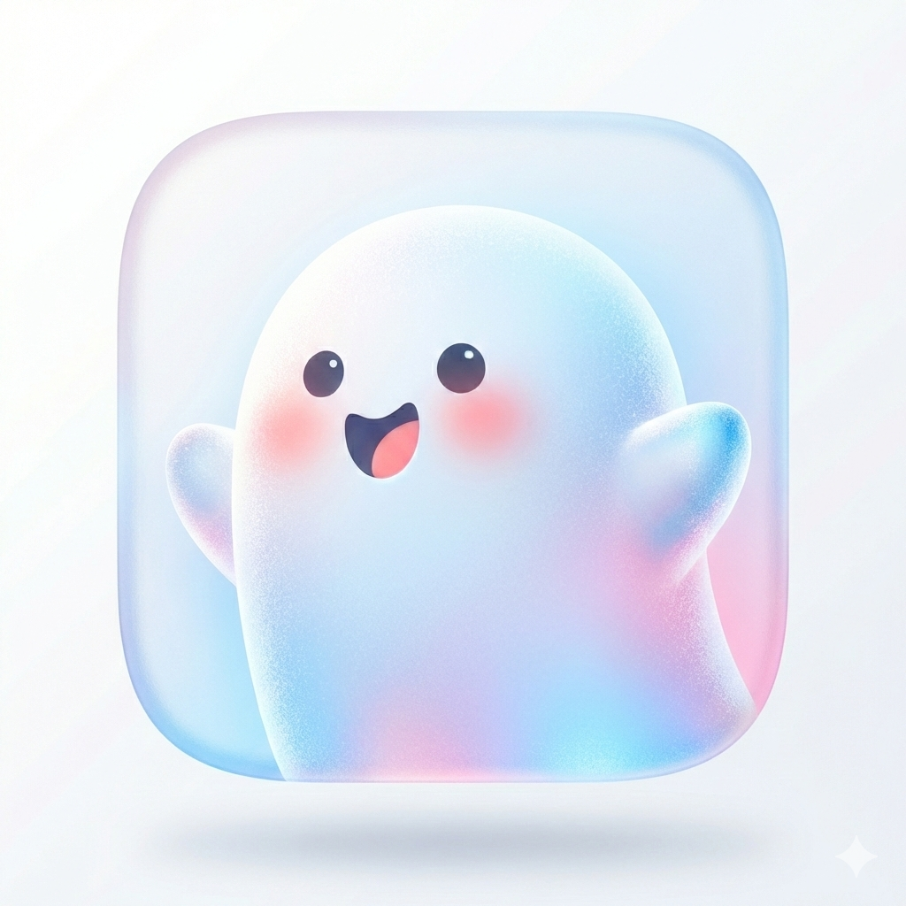

# ClawFace

OpenClaw 的 Android 远程情感显示终端 —— 让 AI 拥有一张「脸」。

ClawFace 以**悬浮窗桌宠**的形式存在于 Android 手机上，通过 UDP 协议接收 OpenClaw 服务端的情绪控制指令，实时呈现 AI 的情感状态。全部视觉元素由程序化矢量图形生成，零 Bitmap，轻量高效。



## 特性

- **10 种情绪表达** — Neutral / Joy / Anxiety / Envy / Embarrassment / Ennui / Disgust / Fear / Anger / Sadness，每种都有独立的颜色、表情参数和程序化动画
- **程序化矢量渲染** — 眼睛（椭圆+瞳孔+高光+光晕）、嘴巴（贝塞尔曲线），纯 Canvas 绘制
- **流畅动画系统** — Lerp 插值平滑过渡、眨眼系统（普通/慢速/双眨眼）、每种情绪专属动画（气球漂浮、高频震颤、融化等）
- **4 种模式** — Active（激活）/ Standby（待机呼吸）/ Thinking（思考中）/ Offline（离线灰色闭眼+Zzz）
- **毛玻璃 UI** — 悬浮窗和控制面板均采用 Glass Morphism 风格
- **OpenClaw 插件** — LLM 通过 Function Calling 自主调用 `update_face` 工具控制表情
- **双向 UDP 通信** — 支持 VPS 服务器模式（NAT 穿透）和局域网直连模式
- **零运行时依赖** — 服务端仅使用 `node:dgram`，无第三方依赖

## 项目结构

```
ClawFace/
├── android/                    # Android 客户端（Kotlin）
│   └── app/src/main/java/com/openclaw/clawface/
│       ├── app/                # Application + MainActivity
│       ├── service/            # 悬浮窗前台 Service
│       ├── view/               # FaceView 自定义绘制视图
│       ├── rendering/          # 渲染器（Eye / Mouth / Glow / GlassCard）
│       ├── animation/          # 动画循环 + 眨眼 + 情绪动画配置
│       ├── state/              # 情绪状态机 + 预设数据
│       ├── network/            # UDP 客户端 + 连接管理
│       ├── protocol/           # 帧定义 + JSON 解析
│       └── config/             # 常量配置
│
├── server/                     # OpenClaw 插件（TypeScript）
│   ├── index.ts                # 插件入口 register(api)
│   ├── openclaw.plugin.json    # 插件清单
│   ├── SKILL.md                # LLM Skill 定义
│   ├── src/
│   │   ├── types.ts            # 类型定义（Emotion / FaceMode / Config）
│   │   ├── schema.ts           # update_face JSON Schema
│   │   ├── prompt.ts           # LLM 提示词模板
│   │   ├── frames.ts           # UDP 帧构建器（匹配 Android FrameParser）
│   │   ├── udp-sender.ts       # 直连模式 UDP 发送器
│   │   ├── udp-server.ts       # 服务器模式 UDP 双向通信
│   │   ├── tool-handler.ts     # update_face 工具处理逻辑
│   │   ├── heartbeat-service.ts # 心跳后台服务
│   │   └── cli-commands.ts     # OpenClaw CLI 命令
│   └── bin/
│       └── clawface-cli.ts     # 独立 CLI 测试工具
│
├── ClawFace需求文档.md
├── ClawFace服务端设计方案.md
└── LICENSE
```

## 快速开始

### 前置条件

- **Android 端**: Android 8.0+ (API 26)，需授权悬浮窗权限
- **服务端**: Node.js 22+，OpenClaw 已安装

### 1. 构建 Android 客户端

```bash
cd android
./gradlew assembleDebug
# APK 输出: app/build/outputs/apk/debug/app-debug.apk
```

安装到手机后，打开 App → 授权悬浮窗权限 → 点击 Start ClawFace。

### 2. 安装服务端插件

```bash
# 进入服务端目录
cd server
npm install

# 验证编译
npx tsc --noEmit
```

### 3. 独立 CLI 测试（不依赖 OpenClaw）

**直连模式**（手机与电脑在同一局域网）：

```bash
# 发送情绪
npx tsx bin/clawface-cli.ts send-emotion JOY --host <手机IP> --port 9527

# 循环演示所有情绪
npx tsx bin/clawface-cli.ts demo --host <手机IP>

# 发送表情参数
npx tsx bin/clawface-cli.ts send-expression '{"mouthCurve":1.0,"eyeScaleY":1.2}' --host <手机IP>
```

**服务器模式**（手机主动连接到服务端）：

```bash
# 启动监听服务
npx tsx bin/clawface-cli.ts serve --port 9527

# 手机 App 中填入服务端 IP 并连接
# 客户端连接后，在交互终端中输入命令：
#   emotion JOY
#   mode THINKING
#   color #FF6B6B
#   demo
```

### 4. 接入 OpenClaw

将插件部署到 OpenClaw 插件目录：

```bash
cp -r server/ ~/.openclaw/plugins/clawface
cd ~/.openclaw/plugins/clawface && npm install
```

编辑 `~/.openclaw/openclaw.json`，添加插件配置：

```json
{
  "plugins": {
    "clawface": {
      "enabled": true,
      "path": "~/.openclaw/plugins/clawface",
      "config": {
        "mode": "server",
        "listenPort": 9527,
        "enableHeartbeat": true,
        "heartbeatIntervalMs": 30000
      }
    }
  }
}
```

重启 OpenClaw 后，LLM 会自动在每次对话时调用 `update_face` 工具控制手机表情。

## 网络模式

| 模式 | 场景 | 配置 |
|------|------|------|
| **server** | VPS 云端部署，手机通过公网连接 | `mode: "server"`, `listenPort: 9527` |
| **direct** | 局域网内直连手机 | `mode: "direct"`, `targetHost: "<手机IP>"`, `targetPort: 9527` |

**Server 模式工作原理**（NAT 穿透）：
1. 手机发送心跳包到 VPS 的 UDP 9527 端口
2. VPS 记住手机的源地址（IP + 端口）
3. VPS 将情绪/表情帧发回该地址
4. 手机通过心跳保持 NAT 映射存活

## 通信协议

所有通信基于 UDP，每个数据包为一个 JSON 帧：

| 帧类型 | 方向 | 格式 | 说明 |
|--------|------|------|------|
| `emotion` | Server→Client | `{"type":"emotion","emotion":"JOY"}` | 切换情绪预设 |
| `expression` | Server→Client | `{"type":"expression","params":{"eyeScaleY":1.2}}` | 精细调参 |
| `mode` | Server→Client | `{"type":"mode","mode":"THINKING"}` | 切换模式 |
| `color` | Server→Client | `{"type":"color","color":"#FF6B6B"}` | 覆盖颜色 |
| `heartbeat` | 双向 | `{"type":"heartbeat"}` | 心跳保活 |
| `heartbeat_ack` | Server→Client | `{"type":"heartbeat_ack"}` | 心跳回复 |

## 情绪一览

| 情绪 | 颜色 | 动画效果 |
|------|------|----------|
| Neutral | 蓝灰 `#AABBCC` | 微弱呼吸脉动 |
| Joy | 金黄 `#FFDD33` | 气球漂浮 + 偶尔双眨眼 |
| Anxiety | 深紫 `#9933FF` | 高频震颤 + 瞳孔微颤 |
| Envy | 暗绿 `#33CC66` | 向光生长 + 脉动缩放 |
| Embarrassment | 粉红 `#FF99AA` | 向下沉缩 + 压扁感 |
| Ennui | 灰蓝 `#8899AA` | 极慢融化 + 慢眨眼 |
| Disgust | 暗绿 `#669933` | 慢摇头 + 撇嘴 |
| Fear | 冰蓝 `#66CCFF` | 间歇性寒颤 + 瞳孔收缩 |
| Anger | 暗红 `#FF3333` | 膨胀沸腾 + 随机猛震 |
| Sadness | 深蓝 `#3366CC` | 叹气下坠 + 不倒翁晃动 |

## 表情参数

通过 `expression` 帧可以精细控制面部：

| 参数 | 范围 | 说明 |
|------|------|------|
| `eyeScaleY` | 0.0 ~ 1.5 | 眼睛纵向缩放（0=闭眼，1.5=瞪眼） |
| `eyeTilt` | -20 ~ +20 | 眼睛倾斜角度（度） |
| `eyeSquint` | 0.0 ~ 1.0 | 眯眼程度 |
| `pupilOffsetX` | -1.0 ~ 1.0 | 瞳孔水平偏移 |
| `pupilOffsetY` | -1.0 ~ 1.0 | 瞳孔垂直偏移 |
| `pupilScale` | 0.5 ~ 1.5 | 瞳孔大小 |
| `mouthCurve` | -1.0 ~ 1.0 | 嘴巴弧度（-1=难过, +1=微笑） |
| `mouthWidth` | 0.0 ~ 1.0 | 嘴巴宽度 |
| `mouthOpen` | 0.0 ~ 1.0 | 嘴巴张开程度 |

## VPS 部署

```bash
# 1. 在 VPS 上克隆项目
git clone <repo-url> ~/ClawFace

# 2. 安装服务端依赖
cd ~/ClawFace/server && npm install

# 3. 复制到 OpenClaw 插件目录
mkdir -p ~/.openclaw/plugins
ln -s ~/ClawFace/server ~/.openclaw/plugins/clawface

# 4. 开放防火墙 UDP 端口
sudo ufw allow 9527/udp   # Ubuntu/Debian
# 云厂商还需在安全组中放行 UDP 9527

# 5. 配置 OpenClaw（编辑 ~/.openclaw/openclaw.json 添加插件）

# 6. 重启 OpenClaw
```

## 技术栈

| 组件 | 技术 |
|------|------|
| Android 客户端 | Kotlin, Android Canvas, Coroutines, ViewBinding |
| 服务端插件 | TypeScript, node:dgram (零运行时依赖) |
| 通信协议 | UDP + JSON |
| 渲染 | 纯程序化矢量（Path/Paint/ShadowLayer） |
| 动画 | Choreographer + 程序化噪音函数 |
| AI 集成 | OpenClaw Plugin API (registerTool / registerService) |

## 开发状态

- [x] Phase 0: 基础骨架 — 悬浮窗 + Neutral 渲染
- [x] Phase 1: 表情系统 — 10 种情绪预设 + Lerp 过渡 + Debug 面板
- [x] Phase 2: 动画系统 — 眨眼 + 程序化噪音动画 + 拖拽
- [x] Phase 3: 网络通信 — UDP + 心跳 + 断线重连
- [x] Phase 4: 服务端插件 — OpenClaw 集成 + 双向 UDP

## 许可证

[MIT](LICENSE)
