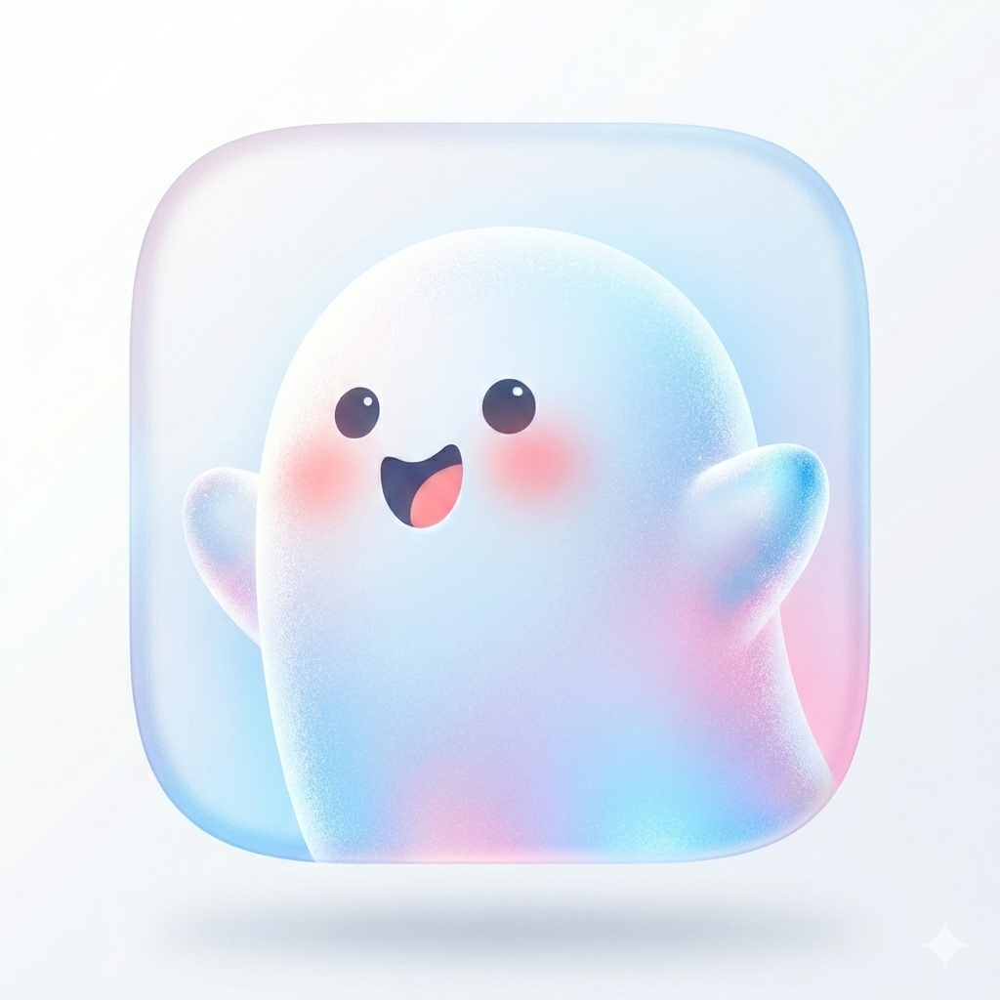

# ClawFace

Android 远程情感显示终端 —— 让 AI 拥有一张「脸」。

ClawFace 以**悬浮窗桌宠**的形式存在于 Android 手机上，通过 WebSocket 接收服务端的情绪控制指令，实时呈现 AI 的情感状态。任何 MCP 兼容的 AI Agent 都可以通过 `update_face` 工具控制表情。全部视觉元素由程序化矢量图形生成，零 Bitmap，轻量高效。



## 特性

- **10 种情绪表达** — Neutral / Joy / Anxiety / Envy / Embarrassment / Ennui / Disgust / Fear / Anger / Sadness，每种都有独立的颜色、表情参数和程序化动画
- **程序化矢量渲染** — 眼睛（椭圆+瞳孔+高光+光晕）、嘴巴（贝塞尔曲线），纯 Canvas 绘制
- **流畅动画系统** — Lerp 插值平滑过渡、眨眼系统（普通/慢速/双眨眼）、每种情绪专属动画（气球漂浮、高频震颤、融化等）
- **4 种模式** — Active（激活）/ Standby（待机呼吸）/ Thinking（思考中）/ Offline（离线灰色闭眼+Zzz）
- **毛玻璃 UI** — 悬浮窗和控制面板均采用 Glass Morphism 风格
- **MCP Server** — 任何 MCP 兼容的 AI Agent 都可以通过 `update_face` 工具控制表情
- **WebSocket 通信** — 持久连接，自动重连，运营商友好，无需 NAT 打洞
- **常驻 Daemon** — 独立于 AI Agent 会话的持久进程，连接不受 Agent 重启影响
- **记住连接信息** — Android 端自动保存上次输入的 IP 和端口

## 架构

```
┌──────────────────────┐     ┌──────────────────────┐
│  AI Agent (Claude)   │     │  Android 手机          │
│                      │     │                      │
│  MCP Server          │     │  WsClient            │
│  (per session,       │────▶│  (OkHttp WebSocket)  │
│   HTTP proxy)        │     │                      │
└──────────┬───────────┘     └──────────▲───────────┘
           │ HTTP                       │ WebSocket
           │ localhost:9527             │ ws://host:9527/ws
           ▼                            │
┌──────────────────────────────────────────────────┐
│  ClawFace Daemon (PM2 常驻进程)                    │
│                                                  │
│  HTTP API (/api/face, /api/status)               │
│  WebSocket Server (/ws)                          │
│  端口: 9527                                       │
└──────────────────────────────────────────────────┘
```

**为什么分离 Daemon 和 MCP Server？**

MCP Server 的生命周期跟 AI Agent 会话绑定 —— 每次对话结束或重启 Agent，MCP Server 就会被回收。如果把 WebSocket 放在 MCP Server 里，手机每隔几分钟就会断连。

Daemon 作为独立常驻进程（PM2 管理），WebSocket 连接不受 Agent 生命周期影响。MCP Server 只是一个轻量 HTTP 客户端，把 AI 的表情控制请求转发给 Daemon。

## 项目结构

```
ClawFace/
├── android/                    # Android 客户端（Kotlin）
│   └── app/src/main/java/com/openclaw/clawface/
│       ├── app/                # MainActivity（调试控制面板）
│       ├── service/            # 悬浮窗前台 Service
│       ├── view/               # FaceView 自定义绘制视图
│       ├── rendering/          # 渲染器（Eye / Mouth / Body / Cheek / Glow）
│       ├── animation/          # 眨眼控制器 + 情绪动画配置
│       ├── state/              # 情绪预设 + FaceParams + AnimationOffset
│       ├── network/            # WsClient + ConnectionManager
│       ├── protocol/           # Frame 定义 + FrameParser
│       └── config/             # AppConfig 常量
│
├── server/                     # 服务端（TypeScript）
│   ├── src/
│   │   ├── daemon.ts           # 常驻进程入口（HTTP + WebSocket 服务）
│   │   ├── index.ts            # MCP Server 入口（HTTP 代理模式）
│   │   ├── ws-server.ts        # WebSocket 服务，管理 Android 客户端连接
│   │   ├── http-api.ts         # HTTP REST API（/api/face, /api/status）
│   │   ├── tool-handler.ts     # update_face 工具处理逻辑
│   │   ├── frames.ts           # JSON 帧构建器（匹配 Android FrameParser）
│   │   ├── types.ts            # 类型定义（Emotion / FaceMode / Sender）
│   │   ├── schemas.ts          # Zod 参数校验
│   │   └── config.ts           # 配置加载
│   └── bin/
│       └── clawface-cli.ts     # 独立 CLI 测试工具
│
├── ClawFace需求文档.md
├── ClawFace服务端设计方案.md
└── LICENSE
```

## 快速开始

### 前置条件

- **Android 端**: Android 8.0+ (API 26)，需授权悬浮窗权限
- **服务端**: Node.js 22+

### 1. 构建 Android 客户端

```bash
cd android
./gradlew assembleDebug
# APK 输出: app/build/outputs/apk/debug/app-debug.apk
```

安装到手机后，打开 App → 授权悬浮窗权限 → 点击 Start ClawFace。

### 2. 启动服务端

```bash
cd server
npm install
npm run build

# 启动 Daemon（推荐用 PM2 守护）
pm2 start dist/daemon.js --name clawface
# 或直接前台运行
npm start
```

启动后会看到：
```
[ClawFace] Daemon listening on :9527 (HTTP + WebSocket)
[ClawFace]   Android: ws://<host>:9527/ws
[ClawFace]   API:     http://127.0.0.1:9527/api/status
```

### 3. 连接手机

在 Android App 中输入服务器 IP 和端口（默认 9527），点击 Connect。状态变为 "Connected" 即成功。

### 4. CLI 测试

Daemon 运行后，可以用 CLI 工具发送命令（通过 HTTP API）：

```bash
# 发送情绪
npx tsx bin/clawface-cli.ts send-emotion JOY

# 切换模式
npx tsx bin/clawface-cli.ts send-mode THINKING

# 发送颜色
npx tsx bin/clawface-cli.ts send-color "#FF6B6B"

# 发送表情参数
npx tsx bin/clawface-cli.ts send-expression '{"mouthCurve":1.0,"eyeScaleY":1.2}'

# 循环演示所有情绪
npx tsx bin/clawface-cli.ts demo

# 查看连接状态
npx tsx bin/clawface-cli.ts status
```

远程服务器上的 Daemon：
```bash
npx tsx bin/clawface-cli.ts status --host <server-ip> --port 9527
```

### 5. 接入 AI Agent（MCP）

在 AI Agent 的 MCP Server 配置中添加 ClawFace：

```json
{
  "clawface": {
    "command": "node",
    "args": ["/path/to/ClawFace/server/dist/index.js"],
    "env": {
      "CLAWFACE_PORT": "9527"
    }
  }
}
```

配置后，AI Agent 会自动获得 `update_face` 和 `get_status` 两个工具。

## 通信协议

Android 客户端通过 WebSocket 连接到 `ws://host:9527/ws`。MCP Server 通过 HTTP 调用 `http://127.0.0.1:9527/api/*`。消息格式均为 JSON：

### WebSocket 帧（Daemon ↔ Android）

| 帧类型 | 方向 | 格式 | 说明 |
|--------|------|------|------|
| `emotion` | Server→Client | `{"type":"emotion","emotion":"JOY"}` | 切换情绪预设 |
| `expression` | Server→Client | `{"type":"expression","params":{"eyeScaleY":1.2}}` | 精细调参 |
| `mode` | Server→Client | `{"type":"mode","mode":"THINKING"}` | 切换模式 |
| `color` | Server→Client | `{"type":"color","color":"#FF6B6B"}` | 覆盖颜色 |
| `heartbeat` | 双向 | `{"type":"heartbeat"}` | 应用层心跳（可选，WebSocket 自带 ping/pong） |
| `heartbeat_ack` | Server→Client | `{"type":"heartbeat_ack"}` | 心跳回复 |

### HTTP API（MCP Server → Daemon）

| 端点 | 方法 | 请求体 | 说明 |
|------|------|--------|------|
| `/api/face` | POST | `{"emotion":"JOY","mode":"ACTIVE","color":"#FF0000","expression":{...}}` | 更新表情（所有字段可选） |
| `/api/status` | GET | — | 返回 `{"connected":true,"client":"1.2.3.4:5678"}` |

## MCP 工具

### update_face

控制 Android 设备上的表情。所有参数可选，可组合使用：

```json
{
  "emotion": "JOY",
  "mode": "ACTIVE",
  "color": "#FFDD33",
  "expression": {
    "eyeScaleY": 1.3,
    "mouthCurve": 1.0,
    "mouthOpen": 0.5
  }
}
```

处理顺序：emotion（设置预设）→ mode → color → expression（在预设基础上微调）。

### get_status

查询连接状态，返回 Android 客户端是否在线。

## 情绪一览

| 情绪 | 颜色 | 动画效果 |
|------|------|----------|
| Neutral | 蓝灰 `#AABBCC` | 微弱呼吸脉动 |
| Joy | 金黄 `#FFDD33` | 气球漂浮 + 偶尔双眨眼 |
| Anxiety | 深紫 `#9933FF` | 高频震颤 + 瞳孔微颤 |
| Envy | 暗绿 `#33CC66` | 向光生长 + 脉动缩放 |
| Embarrassment | 粉红 `#FF99AA` | 向下沉缩 + 压扁感 |
| Ennui | 灰蓝 `#8899AA` | 极慢融化 + 慢眨眼 |
| Disgust | 暗绿 `#669933` | 慢摇头 + 撇嘴 |
| Fear | 冰蓝 `#66CCFF` | 间歇性寒颤 + 瞳孔收缩 |
| Anger | 暗红 `#FF3333` | 膨胀沸腾 + 随机猛震 |
| Sadness | 深蓝 `#3366CC` | 叹气下坠 + 不倒翁晃动 |

## 表情参数

通过 `expression` 帧可以精细控制面部：

| 参数 | 范围 | 说明 |
|------|------|------|
| `eyeScaleY` | 0.0 ~ 1.5 | 眼睛纵向缩放（0=闭眼，1.5=瞪眼） |
| `eyeTilt` | -20 ~ +20 | 眼睛倾斜角度（度） |
| `eyeSquint` | 0.0 ~ 1.0 | 眯眼程度 |
| `pupilOffsetX` | -1.0 ~ 1.0 | 瞳孔水平偏移 |
| `pupilOffsetY` | -1.0 ~ 1.0 | 瞳孔垂直偏移 |
| `pupilScale` | 0.5 ~ 1.5 | 瞳孔大小 |
| `mouthCurve` | -1.0 ~ 1.0 | 嘴巴弧度（-1=难过, +1=微笑） |
| `mouthWidth` | 0.0 ~ 1.0 | 嘴巴宽度 |
| `mouthOpen` | 0.0 ~ 1.0 | 嘴巴张开程度 |

## 部署

### VPS 部署

```bash
# 1. 克隆项目
git clone <repo-url> ~/ClawFace

# 2. 构建服务端
cd ~/ClawFace/server
npm install
npm run build

# 3. PM2 启动 Daemon
pm2 start dist/daemon.js --name clawface
pm2 save

# 4. 开放防火墙 TCP 端口（注意是 TCP，不是 UDP）
sudo ufw allow 9527/tcp   # Ubuntu/Debian
# 云厂商还需在安全组中放行 TCP 9527
```

### 更新

```bash
cd ~/ClawFace && git pull
cd server && npm run build
pm2 restart clawface
```

### 环境变量

| 变量 | 默认值 | 说明 |
|------|--------|------|
| `CLAWFACE_PORT` | `9527` | Daemon 监听端口（HTTP + WebSocket） |

## 技术栈

| 组件 | 技术 |
|------|------|
| Android 客户端 | Kotlin, OkHttp WebSocket, Android Canvas, Coroutines, ViewBinding |
| 服务端 Daemon | TypeScript, ws (WebSocket), Node.js http |
| MCP Server | TypeScript, @modelcontextprotocol/sdk |
| 通信协议 | WebSocket + JSON |
| 渲染 | 纯程序化矢量（Path/Paint/ShadowLayer） |
| 动画 | Choreographer + 程序化噪音函数 |
| 进程管理 | PM2 |

## 许可证

[MIT](LICENSE)
